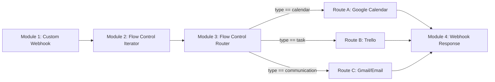

# Make.com Scenario Architecture & Field Mapping Guide

This guide describes how to configure the Make.com (Integromat) automation scenario to ingest, iterate, route, and execute the multi-intent action payloads dispatched by the VoiceForge Ops backend.

---

## 🛠️ Step-by-Step Scenario Blueprint



---

## 📋 Module Configuration Details

### 1. Module 1: Custom Webhook
*   **Type**: `Webhooks` -> `Custom Webhook`
*   **Method**: `POST`
*   **Purpose**: Receives the consolidated JSON payload from VoiceForge Ops.
*   **Ingestion Sample Payload**:
    ```json
    {
      "summary": "Meeting with Lead Architect and deployment prep",
      "meta": {
        "confidence_score": 0.98,
        "risk_level": "LOW",
        "requires_human_confirmation": false,
        "estimated_execution_time_ms": 320,
        "schedule_conflicts": []
      },
      "actions": [
        {
          "type": "calendar",
          "title": "Architecture Sync",
          "start_time": "2026-08-21T10:00:00Z",
          "duration_minutes": 30
        },
        {
          "type": "task",
          "board": "Engineering",
          "title": "Push Docker staging build",
          "priority": "High"
        },
        {
          "type": "communication",
          "channel": "email",
          "recipient": "lead@voiceforge.ai",
          "subject": "Sync Agenda",
          "body": "Hi team, let's review the staging build."
        }
      ]
    }
    ```

### 2. Module 2: Flow Control -> Iterator
*   **Type**: `Flow Control` -> `Iterator`
*   **Input Array**: `1. actions[]` (extracted from the Webhook payload).
*   **Purpose**: Iterates through each dictionary in the actions list to handle them individually.

### 3. Module 3: Flow Control -> Router
*   **Type**: `Flow Control` -> `Router`
*   **Purpose**: Routes execution paths based on individual action types.

#### Route A: Google Calendar (Create an Event)
*   **Filter Name**: `Calendar Routing`
*   **Condition**: `type` (from Iterator) **Equal to (case-insensitive)** `calendar`
*   **Action Module**: `Google Calendar` -> `Create an Event`
*   **Field Mappings**:
    *   **Calendar ID**: Select your target calendar.
    *   **Event Name**: `title`
    *   **Start Date**: `start_time`
    *   **End Date**: `addMinutes(start_time; duration_minutes)` (using Make's built-in date-time functions).
    *   **Description**: `Dispatched autonomously by VoiceForge Ops.`

#### Route B: Trello (Create a Card)
*   **Filter Name**: `Trello Task Routing`
*   **Condition**: `type` (from Iterator) **Equal to (case-insensitive)** `task`
*   **Action Module**: `Trello` -> `Create a Card`
*   **Field Mappings**:
    *   **Board**: Select target Board (dynamically maps or targets standard sprint board).
    *   **List ID**: Select target list ID (e.g. Backlog or Sprint To-Do).
    *   **Card Name**: `title`
    *   **Description**: `Priority: {{priority}} | Dispatched autonomously by VoiceForge Ops`
    *   **Labels**: Optional color coding matching Priority values (`High` = Red, `Medium` = Yellow).

#### Route C: Gmail (Send an Email or Create Draft)
*   **Filter Name**: `Email/Slack Communication Routing`
*   **Condition**: `type` (from Iterator) **Equal to (case-insensitive)** `communication`
*   **Action Module**: `Gmail` -> `Send an Email` or `Create a Draft`
*   **Field Mappings**:
    *   **To**: `recipient`
    *   **Subject**: `subject`
    *   **Content (HTML or Text)**: `body`

### 4. Module 4: Webhook Response
*   **Type**: `Webhooks` -> `Webhook Response`
*   **Status**: `200`
*   **Body (JSON)**:
    ```json
    {
      "status": "executed",
      "timestamp": "{{now}}"
    }
    ```
    *(Use Make's dynamic date variables to populate the timestamp).*
