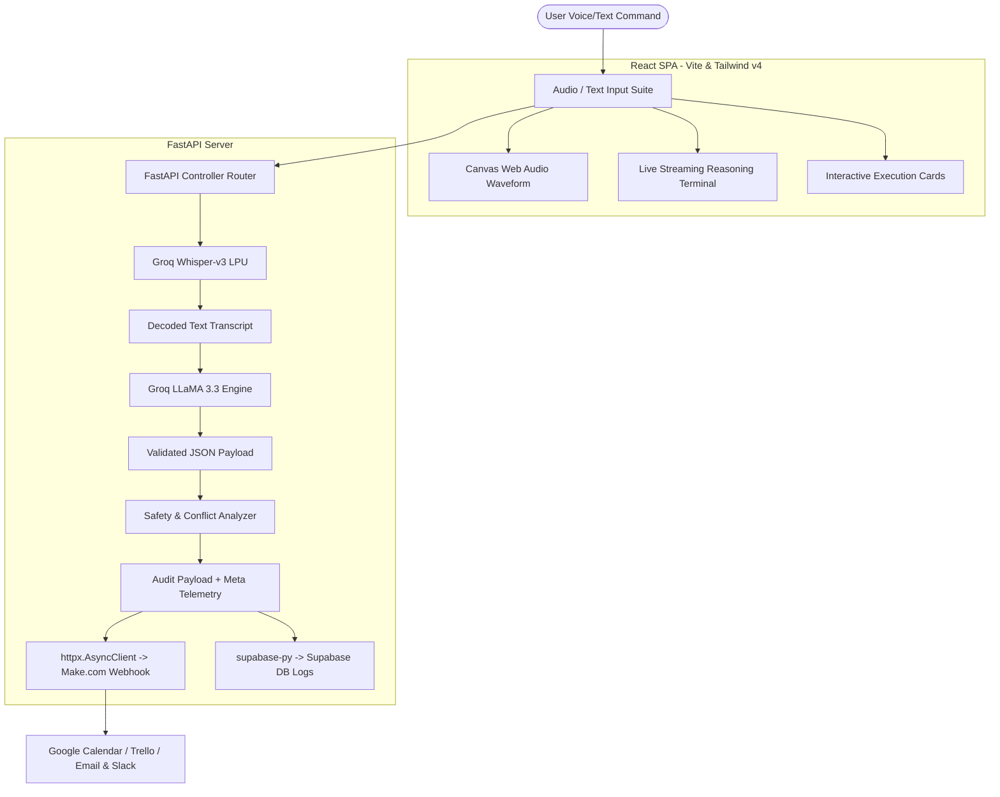

# VoiceForge Ops // Autonomous Executive AI Agent System

VoiceForge Ops is an elite, autonomous AI executive operations dashboard designed for modern enterprise workflows. It translates natural audio/voice commands or unstructured transcripts into validated, multi-intent action items (Calendar events, Trello tasks, Gmail drafts, Slack notifications), evaluates risks, resolves schedule conflicts, and dispatches tasks through automated pipeline integrations.

---

## 🚀 Key Features

*   **🎙️ Real-time Voice Command Transcription**: Powered by Groq LPU processing and the Whisper-v3 (`whisper-large-v3`) engine for sub-second, multi-lingual audio decoding.
*   **🧠 Multi-Intent Reasoning Engine**: Powered by Groq (`openai/gpt-oss-120b`) Chat Completions, parsing complex operations into discrete intents.
*   **⚠️ Safety & Conflict Detection Engine**: Automated analysis of data operations:
    *   **Confidence Scoring**: Gauges understanding accuracy.
    *   **Risk Categorization**: Flags critical financial/credential threats or medium-level external domains.
    *   **Schedule Conflict Detection**: Scans and flags overlapping calendar items or impossible deadlines.
*   **⚡ Webhook & Database Dispatch Router**: Asynchronously forwards payloads to Make.com (Integromat) webhooks and stores persistent transaction logs in Supabase.
*   **💻 Sleek Mission Control Dashboard**: Custom dark-mode Single Page Application (SPA) styled using Tailwind CSS v4, Lucide React, and Framer Motion, with integrated canvas audio visualizers.

---

## 🏗️ System Architecture



---

## 📂 Project Directory Structure

```text
VoiceForge_Ops/
├── backend/
│   ├── app/
│   │   ├── __init__.py
│   │   ├── config.py           # Envs, log configurations & Groq/Supabase client instantiations
│   │   ├── models.py           # Pydantic schemas for endpoint data validation
│   │   └── services.py         # Business operations (Whisper, LLaMA parser, webhook dispatcher)
│   ├── .env.example            # Environment template configuration keys
│   ├── requirements.txt        # Python dependency packages
│   └── main.py                 # FastAPI initialization, middleware, and route mappings
│
├── frontend/
│   ├── src/
│   │   ├── components/
│   │   │   ├── Header.jsx        # Navigation bar & status indicators
│   │   │   ├── AudioInput.jsx    # Microphone recorder, visualizer & demo presets
│   │   │   ├── LiveTerminal.jsx  # Monospace console streaming agent thinking logs
│   │   │   ├── ActionCards.jsx   # Interactive execution cards & risk telemetry
│   │   │   └── HistoryDrawer.jsx # Slide-over audit history panel
│   │   ├── App.jsx             # React core orchestration & state management
│   │   ├── index.css           # Tailwind v4 directives, custom theme properties
│   │   └── main.jsx            # React root mount point
│   ├── package.json            # Node.js dependencies
│   ├── index.html              # Main application frame
│   └── vite.config.js          # Vite config bundling Tailwind v4
│
└── README.md                   # Project documentation & configuration guide
```

---

## ⚙️ Installation & Configuration

### Prerequisites
*   Python 3.10+
*   Node.js 18+
*   A Groq API Key (from console.groq.com)
*   A Supabase project (Optional)
*   A Make.com webhook URL (Optional)

### 1. Setup Backend
1. Navigate to the `backend/` directory:
   ```bash
   cd backend
   ```
2. Create and activate a Python virtual environment:
   ```bash
   python -m venv .venv
   # On Windows:
   .venv\Scripts\activate
   # On macOS/Linux:
   source .venv/bin/activate
   ```
3. Install the dependencies:
   ```bash
   pip install -r requirements.txt
   ```
4. Configure environment variables. Duplicate `.env.example` as `.env` and fill in your details:
   ```env
   GROQ_API_KEY=your_groq_api_key_here
   MAKE_WEBHOOK_URL=your_webhook_url_here
   SUPABASE_URL=your_supabase_project_url_here
   SUPABASE_KEY=your_supabase_anon_key_here
   ```

### 2. Setup Frontend
1. Navigate to the `frontend/` directory:
   ```bash
   cd ../frontend
   ```
2. Install npm packages:
   ```bash
   npm install
   ```

---

## 🚀 Running the System

Start both servers concurrently to run the end-to-end autonomous agent loop:

### Start the Backend (FastAPI)
From the `backend/` folder:
```bash
.venv\Scripts\uvicorn main:app --reload --port 8000
```
*The API server will run on `http://127.0.0.1:8000/`.*

### Start the Frontend (Vite)
From the `frontend/` folder:
```bash
npm run dev
```
*The application interface will open on `http://localhost:5173/`.*

---

## 🔬 API Endpoint References

| Method | Endpoint | Description |
| :--- | :--- | :--- |
| **GET** | `/` | API status health-check |
| **POST** | `/api/transcribe` | Decodes uploaded audio into raw text transcript |
| **POST** | `/api/parse-actions` | Translates raw text into structured items + risk telemetry |
| **POST** | `/api/dispatch` | Transfers validated payload to Webhook and records in Supabase |
| **POST** | `/api/process-audio` | One-click end-to-end pipeline runner |
| **GET** | `/api/stream-reasoning` | Server-Sent Events (SSE) reasoning log generator |
| **POST** | `/api/simulate-execution` | Processes simulated dry-run validation |

---

## 📜 Demo Preset Test Scenarios

The dashboard features **1-Click Judge Presets** for easy testing without active microphone recordings:
1.  **Morning Executive Sync**: Resolves relative times ("tomorrow at 9 AM" becomes exact timestamp), drafts planning emails, and updates marketing boards.
2.  **Emergency Hotfix & Deployment**: Prompts a `CRITICAL` risk telemetry warning and requires manual human confirmation because it is flagged as an urgent server patch.
3.  **Investor Pitch Scheduling**: Generates calendar sync cards and drafts follow-up messages for partners.

---

## 📱 Testing on a Phone

The dashboard layout is responsive (tap-to-speak mic button, stacked cards, full-width history drawer), but the browser **microphone API only works over a secure context** — `localhost` or HTTPS, never a plain `http://<lan-ip>:5173` URL. To try voice input from a real phone on the same Wi-Fi:
1. Run `npm run dev -- --host` in `frontend/` and note the "Network" URL Vite prints.
2. Tunnel it through HTTPS (e.g. `npx ngrok http 5173`) and open the `https://` tunnel URL on the phone — mobile Chrome/Safari will refuse `getUserMedia` on a bare HTTP LAN address.
3. Update `API_BASE` in `frontend/src/App.jsx` (or the CORS origins in `backend/main.py`) if the backend is reached via a different host than `127.0.0.1`.

Without a tunnel, the mic button will fail silently on mobile browsers — the file-upload and demo-preset flows still work over plain HTTP.
