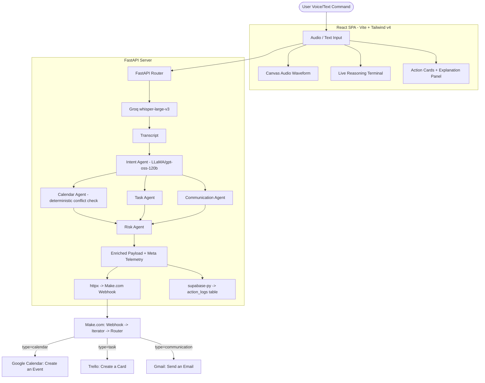

# VoiceForge Ops // Autonomous Executive AI Agent System

VoiceForge Ops turns a spoken or typed command into real actions in your actual tools. Say (or type) something like:

> "Schedule a team sync tomorrow at 10am, make a high-priority Trello card to fix the login bug, and email jane@example.com about the budget."

...and the system transcribes it, splits it into structured actions, checks each one for scheduling conflicts and risk, shows you exactly what it's about to do and why, and — once you approve — dispatches it to **Google Calendar, Trello, and Gmail** through a live Make.com automation.

---

## 🚀 Key Features

* **🎙️ Voice or Text Input**: Record from the mic, drop an audio file, or type — transcription runs through Groq's `whisper-large-v3`.
* **🧠 Multi-Agent Reasoning Pipeline** (not a single LLM call): an Intent Agent splits the transcript into actions, a Calendar Agent deterministically checks/resolves scheduling conflicts, a Task Agent and Communication Agent enrich routing, and a Risk Agent scores confidence and flags anything needing human confirmation. See [`docs/DECISIONS.md`](docs/DECISIONS.md) for why it's built this way.
* **⚠️ Safety & Conflict Detection**: confidence scoring, LOW/MEDIUM/CRITICAL risk levels, and real (non-hallucinated) calendar conflict resolution — conflicting events are automatically rescheduled to the next free business-hours slot.
* **🔍 Explanation Panel**: every action card shows the AI's reasoning for that specific decision, plus a pipeline trace (which agents ran) and the overall risk rationale — not just a black-box result.
* **⚡ Live Dispatch Router**: sends the validated payload to a Make.com webhook (which fans out to Google Calendar / Trello / Gmail) and logs a full audit trail to Supabase.
* **💻 Mission Control Dashboard**: dark-mode React SPA with a live audio waveform visualizer, a streaming reasoning terminal, interactive action cards, and an audit history drawer — responsive down to mobile.

---

## 🏗️ System Architecture



---

## 🧰 Tools & Services Used

| Layer | Tool | Purpose |
| :--- | :--- | :--- |
| Transcription | **Groq — `whisper-large-v3`** | Voice-to-text |
| Reasoning | **Groq — `openai/gpt-oss-120b`** | Intent extraction + risk scoring (JSON mode). Swapped in after Groq deprecated `llama-3.3-70b-versatile` — see `docs/DECISIONS.md` ADR-004. |
| Backend | **FastAPI** (Python) | API server, multi-agent orchestration |
| Frontend | **React 19 + Vite + Tailwind v4** | Dashboard SPA |
| Automation | **Make.com** | Webhook → Iterator → Router → Google Calendar / Trello / Gmail |
| Database | **Supabase** (Postgres) | `action_logs` audit trail |
| Hosting | **Render** | `render.yaml` blueprint deploys both frontend (static) and backend (web service) |
| Code review | **Prelint** | Reviews PRs on this repo against `docs/DECISIONS.md` |
| Version control | **GitHub** | `github.com/habib-u-rahman/voiceforge-ops` |

---

## 📂 Project Directory Structure

```text
VoiceForge_Ops/
├── backend/
│   ├── app/
│   │   ├── config.py            # Env vars, logging, Groq/Supabase client setup
│   │   ├── models.py            # Pydantic request/response schemas
│   │   └── services.py          # Multi-agent pipeline + dispatch logic
│   ├── .env.example             # Env var template
│   ├── .python-version          # Pinned Python version for Render
│   ├── requirements.txt
│   ├── supabase_schema.sql      # Run once in Supabase's SQL Editor
│   └── main.py                  # FastAPI app, routes, CORS config
│
├── frontend/
│   ├── src/
│   │   ├── components/
│   │   │   ├── Header.jsx         # Status bar, Dry-run/Live toggle
│   │   │   ├── AudioInput.jsx     # Mic recorder, file upload, demo presets
│   │   │   ├── LiveTerminal.jsx   # Streaming agent reasoning log
│   │   │   ├── ActionCards.jsx    # Action cards + explanation panel
│   │   │   └── HistoryDrawer.jsx  # Audit history slide-over
│   │   ├── App.jsx               # Core state + API orchestration
│   │   └── main.jsx
│   ├── .env.example              # VITE_API_BASE template
│   └── package.json
│
├── docs/
│   └── DECISIONS.md              # Architecture decision log (also read by Prelint)
│
├── render.yaml                   # Render Blueprint: deploys both services
├── MAKE_WORKFLOW_SETUP.md        # How the Make.com scenario is built
└── README.md
```

---

## ⚙️ Local Setup

### Prerequisites
* Python 3.13+ and Node.js 18+
* A [Groq API key](https://console.groq.com) (required)
* A [Supabase](https://supabase.com) project (optional — enables audit logging)
* A [Make.com](https://www.make.com) account (optional — enables real dispatch to Calendar/Trello/Gmail)

### 1. Backend
```bash
cd backend
python -m venv .venv
.venv\Scripts\activate        # Windows
# source .venv/bin/activate   # macOS/Linux
pip install -r requirements.txt
```
Copy `.env.example` to `.env` and fill in:
```env
GROQ_API_KEY=your_groq_api_key
MAKE_WEBHOOK_URL=your_make_webhook_url        # optional
SUPABASE_URL=your_supabase_project_url        # optional
SUPABASE_KEY=your_supabase_service_role_key   # optional — service_role, NOT anon
```
If using Supabase, run `backend/supabase_schema.sql` once in the Supabase SQL Editor to create the `action_logs` table.

### 2. Frontend
```bash
cd frontend
npm install
```
`frontend/.env.example` documents `VITE_API_BASE` — leave it unset for local dev (defaults to `http://127.0.0.1:8000`).

### 3. Make.com Scenario (optional, for live dispatch)
Follow [`MAKE_WORKFLOW_SETUP.md`](MAKE_WORKFLOW_SETUP.md) to build the automation: a Custom Webhook trigger → Iterator over `actions[]` → Router with three filtered routes (`type = calendar` → Google Calendar "Create an Event", `type = task` → Trello "Create a Card", `type = communication` → Gmail "Send an email"), each ending in a Webhook Response module. Turn the scenario ON and paste its webhook URL into `MAKE_WEBHOOK_URL`.

---

## 🚀 Running Locally

**Backend** (from `backend/`):
```bash
.venv\Scripts\uvicorn main:app --reload --port 8000
```
Runs at `http://127.0.0.1:8000/`.

**Frontend** (from `frontend/`):
```bash
npm run dev
```
Runs at `http://localhost:5173/` (Vite picks the next free port, e.g. `5174`, if that's taken).

---

## ☁️ Deploying to Render

The repo root includes `render.yaml`, a Blueprint that provisions both services from one connect step:

1. Render dashboard → **New → Blueprint** → connect this GitHub repo. Render reads `render.yaml` and proposes `voiceforge-ops-backend` (Python web service) and `voiceforge-ops-frontend` (static site).
2. Set the backend's env vars in the Render dashboard (`GROQ_API_KEY`, `SUPABASE_URL`, `SUPABASE_KEY`, `MAKE_WEBHOOK_URL`) — they're intentionally left out of `render.yaml` so no secret ever touches git.
3. Once the backend deploys, copy its public URL and set it as `VITE_API_BASE` on the frontend service, which triggers a rebuild with that value baked in.

The backend runs as a normal long-lived `uvicorn` process (not a serverless function), so it comfortably handles the multi-step Groq pipeline and the SSE reasoning stream without timeout concerns.

---

## 🔬 API Endpoint Reference

| Method | Endpoint | Description |
| :--- | :--- | :--- |
| **GET** | `/` | Health check |
| **POST** | `/api/transcribe` | Audio file → raw transcript (Whisper) |
| **POST** | `/api/parse-actions` | Transcript → structured actions + risk telemetry (multi-agent pipeline) |
| **POST** | `/api/dispatch` | Validated payload → Make.com webhook + Supabase log |
| **POST** | `/api/process-audio` | One-shot: transcribe → parse → dispatch |
| **GET** | `/api/stream-reasoning` | SSE demo stream of reasoning steps |
| **POST** | `/api/simulate-execution` | Dry-run validation, no side effects |

---

## 📜 Demo Preset Test Scenarios

Judge Demo Presets let you exercise the full pipeline without a microphone:
1. **Morning Executive Sync** — resolves relative times ("tomorrow at 9 AM"), drafts a planning email, creates a marketing task.
2. **Emergency Hotfix Alert** — triggers a `MEDIUM`/`CRITICAL` risk flag and requires human confirmation as an urgent server patch.
3. **Investor Pitch Setup** — calendar sync plus a follow-up email draft.

---

## 📱 Testing on a Phone

The layout is responsive (tap-to-speak button, stacked cards, full-width history drawer), but the browser microphone API only works over a secure context — `localhost` or HTTPS, never a bare `http://<lan-ip>:5173`. To test voice input from a phone on the same Wi-Fi:
1. Run `npm run dev -- --host` and note the "Network" URL Vite prints.
2. Tunnel it through HTTPS (e.g. `npx ngrok http 5173`) and open the tunnel URL on the phone.
3. Point `VITE_API_BASE` / the backend's `ALLOWED_ORIGINS` at whichever hosts you're actually using if they differ from localhost.

Without a tunnel, the mic button fails silently on mobile — file upload and demo presets still work over plain HTTP.

---

## 🐛 Known Gotchas

* **`NotFoundError` on the mic button**: means the browser found no microphone device at the OS level (not a permissions issue). Check Windows Sound settings → Input, and Privacy & Security → Microphone. File upload and demo presets work regardless.
* **Dispatch shows `SKIPPED` for webhook/Supabase despite correct `.env`**: almost always a stale backend process still bound to the port from before the `.env` was fully populated (env vars are only read once, at process startup). Kill all `uvicorn`/`python` processes on port 8000 and restart.
* **Groq model 404s**: Groq's hosted model catalog changes over time. If `openai/gpt-oss-120b` disappears, check `client.models.list()` for a current chat-capable model and update the two `model=` references in `backend/app/services.py`.
